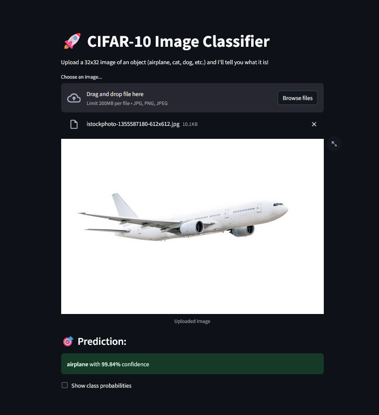

# 🚀 CIFAR‑10 Image Classifier

A **Streamlit-based web application** that classifies uploaded images into one of the ten **CIFAR‑10** categories using a pre-trained **TensorFlow/Keras CNN** model.

> Upload a 32×32 image (e.g., dog, ship, airplane, etc.), and the model will predict the class and its confidence level.



---

## 📦 CIFAR‑10 Categories

| Index | Emoji | Class      |
|------:|:-----:|------------|
| 0     | ✈️    | Airplane   |
| 1     | 🚗    | Automobile |
| 2     | 🐦    | Bird       |
| 3     | 🐱    | Cat        |
| 4     | 🦌    | Deer       |
| 5     | 🐶    | Dog        |
| 6     | 🐸    | Frog       |
| 7     | 🐴    | Horse      |
| 8     | 🚢    | Ship       |
| 9     | 🚚    | Truck      |

---

## 🧠 Model Summary

- **Model Type:** Convolutional Neural Network (CNN)
- **Dataset:** CIFAR-10 (built into Keras)
- **Input Shape:** 32 × 32 × 3 RGB image
- **Training Accuracy:** ~80–90%
- **Framework:** TensorFlow / Keras

---

## 🛠️ Tech Stack

- **Python**
- **Streamlit** – Interactive Web UI
- **TensorFlow / Keras** – CNN model training and prediction
- **NumPy** – Numerical operations
- **Pillow (PIL)** – Image handling

---

## 📁 Project Structure
cifar10-streamlit-app/
├── image_classifier.py # Streamlit app script
├── cifar10_model.h5 # Trained CNN model
├── requirements.txt # Python dependencies
├── screenshot.png # App preview image
└── README.md # This file


---

## 🖥️ How to Run Locally

### 1. Clone the Repository

```bash
git clone https://github.com/Amalroy2003/CIFAR-10-Image-Classifier-Web-App.git
cd CIFAR-10-Image-Classifier-Web-App
streamlit run image_classifier.py
```
🖼️ How It Works

Upload a .jpg, .jpeg, or .png image
The image is resized to 32×32 and normalized
The CNN model predicts the category and confidence
Optionally view all class probabilities


🙋‍♂️ Author
Amal Roy
📧 amal.roy2100@gmail.com
🔗 GitHub – @amalroy2003

